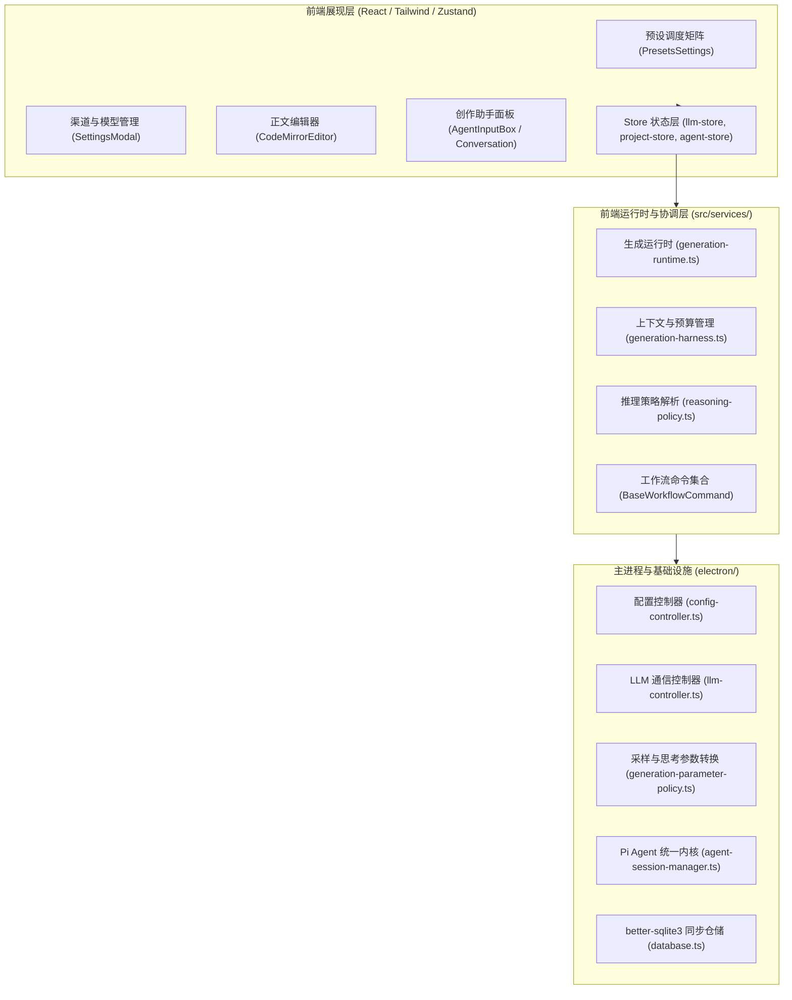

# AGENTS.md — AI-Novel-Writer (Vela) 架构与工程规范指南

> 本文档是所有 AI Agent（以及维护者）在阅读、修改、扩展本项目代码时的权威上下文与行为准则。在进行任何代码修改或功能设计前，必须严格遵守本文档所规定的原则。

---

## 核心硬性设计规范（Critical Rules for Agents）

### 1. 默认严禁添加 Emoji 图标（Zero Emoji Default）
* **硬性规定**：在所有用户界面（UI）、卡片标题、表单 Label、下拉菜单选项、系统提示、按钮文案中，**默认一律严禁添加任何 Emoji 表情符号**（例如：星星、闪电、大脑、火箭、备忘录、握笔、放大镜、齿轮、灯泡等符号）。
* **原因与风格定位**：本项目是一个专业级长篇小说创作桌面 IDE，面向严肃创作者，追求**极简、克制、纯粹、专业**的工具质感。繁杂的 Emoji 会带来廉价的“AI 玩具感”与严重的视觉噪音。
* **图标规范**：需要视觉引导或区分维度时，统一使用经过统一设计语言约束的 `lucide-react` 矢量图标；文案本身保持干净纯粹。

### 2. 文案极致精炼，拒绝啰嗦废话
* 下拉菜单选项直接使用最简短明确的名词（如：`全局默认`、`关闭`、`低`、`中`、`高`、`最高`），**严禁**在选项后面追加冗长的解释性括号后缀（如禁止写成 `低思考 (Low) - 适度推演，流畅快速`）。
* 界面标签与说明文字直奔主题，拒绝 AI 产品经理式的空话套话。

### 3. 从根因出发重构，坚决拒绝表面启发式“猜谜”代码
* 当遇到历史脏数据、概念混淆或逻辑冲突时，必须从数据结构定义、IPC 通信契约和状态源头彻底解耦重构；
* **严禁**编写基于正则、特殊字符启发式猜测、或者临时前缀判断等“打补丁”代码（例如严禁编写 `isLegacyChannelNamePollution` 这类魔法猜谜函数）；
* 保证实体边界清晰、职责单一：渠道负责通信认证，模型负责采样执行，预设负责业务调度。

### 4. 即时自动持久化（Immediate Auto-persistence）
* 设置项变动（模型、思考强度、预设、外观等）必须在发生改变时立即自动持久化保存到磁盘（`~/.vela/config.json` 或项目文件）；
* 坚决避免强迫用户修改后四处寻找并点击“保存”按钮的过时交互体验。

---

## 项目全景与技术架构

AI-Novel-Writer（代号 Vela）是一个面向长篇小说严肃创作的**本地优先（Local-first）桌面 IDE**。

### 1. 技术栈构成
* **宿主环境**：Electron + Node.js (v20+)
* **前端框架**：React 19 + TypeScript + Tailwind CSS
* **状态管理**：Zustand（按领域拆分的专用 Store）
* **核心编辑器**：CodeMirror 6（深度定制的小说排版、段落沉浸、行号计算、双语对齐、差异 Diff 比对）
* **测试体系**：Vitest（单元测试）+ Vitest Browser Mode（基于 Playwright Chromium 的真实浏览器 DOM 测试）
* **持久化**：
  * 全局配置：`~/.vela/config.json`
  * 模型凭据：`~/.vela/models.json`
  * 最近工程：`~/.vela/recent-projects.json`
  * 全局助手会话：`~/.vela/agent-sessions/`
  * 项目内部：`<项目根>/.vela/vela.db`（SQLite 权威事实表）与 `<项目根>/.vela/agent-sessions/`（Pi Agent 原生会话事件日志）

### 2. 分层架构概览



---

## 核心领域系统详解

### 1. 渠道与模型体系（Channels & Models Separation）
* **Channel（模型渠道 / 传输网关）**：
  * 负责传输凭证与网络端点：`provider`（如 openai, gemini, deepseek, ollama, custom）、`protocol`、`baseUrl`、`apiKey`、`channelName`；
  * 一个渠道下可以包含 1 个或多个具体模型。
* **Model（具体执行模型）**：
  * 负责模型本身执行维度的配置：`modelName`（提供商实际模型 ID）、`name`（用户别名）、`temperature`、`contextWindowTokens`、`maxOutputTokens`、`capabilities`；
  * 单个模型的采样参数由该模型独立持有，严禁提升到渠道全局。
* **统一分组展示**：
  * 前端通过 `src/shared/agent-runtime.ts` 的 `groupModelsByChannel(models)` 函数将离散的模型档案按渠道进行稳定聚类，供所有下拉框和列表渲染。

### 2. 创作环节模型与思考调度矩阵（Task Model Routing & Presets）
系统将长篇小说全生命周期的 5 大幕后 AI 生成环节端到台前，让作者对幕后调用的模型和思考预算拥有 100% 知情权与支配权：

| 环节标识 (`CreationTaskKey`) | 对应创作场景 | 运行时语义 |
| :--- | :--- | :--- |
| `outline` | 《小说设定》面板中核心大纲、世界观、人物设定、金手指等字段生成 | `reasoningStage: 'planning'` |
| `planning` | 故事架构规划、分卷大纲、主支线推演、章节细纲拆解 | `reasoningStage: 'planning'` |
| `drafting` | 编辑器章节正文起草、段落扩写、剧情续写、对话生成 | `reasoningStage: 'drafting'` |
| `review` | 审稿面板错漏排查、前后文冲突检测、伏笔核验、正文润色 | `reasoningStage: 'review'` |
| `assistant` | 右侧边栏 AI 创作助手日常灵感碰撞、设定问答 | `reasoningStage: 'general'` |

* **双层调度机制**：
  * **全局默认基准**：在「预设」顶部设置 `defaultModelId`（全局默认模型）与 `defaultThinkingLevel`（全局默认思考）；
  * **环节级配置**：下方 5 个环节的模型下拉框选择 `全局默认` 时，自动跟随基准；思考下拉框选择 `全局默认` 时，自动跟随基准思考；单独指定时则专属覆盖。
* **解析服务接口**：
  * `useLLMStore.getState().resolveTaskModelId(taskKey)`：解析该环节当前应使用的具体模型 ID（优先专属，优雅回退到默认）；
  * `useLLMStore.getState().resolveTaskThinkingLevel(taskKey)`：解析该环节当前应使用的思考强度（关闭/低/中/高/最高）。

### 3. 统一思考与推理策略（Reasoning Policy Engine）
* 位于 `src/shared/reasoning-policy.ts`，是整个应用唯一的推理能力计算 Seam；
* 将抽象的业务意图（`off` | `low` | `medium` | `high` | `max`）映射为不同 Provider 的真实 API 参数：
  * **OpenAI / Relay**：映射为 `reasoning_effort: 'low' | 'medium' | 'high'`；
  * **Google Gemini**：映射为 `thinkingBudget: 0 | 1024 | 8192 | 24576`；
  * **DeepSeek V4**：映射为 `thinking: { type: 'enabled', reasoning_effort: ... }` 或 `thinking: { type: 'disabled' }`；
* **安全优雅降级**：若模型本身不支持推理思考（`capabilities.reasoning !== true`），策略自动返回 `status: 'unsupported'`，底层直接发起标准采样请求，绝不会发送非法字段给服务商导致报错中断。

### 4. 生成运行时与任务取消调度（Generation Runtime & AbortSignal）
* 位于 `src/services/generation/generation-runtime.ts`；
* 生成请求统一封装为 `GenerationCompletionRequest`（携带 `modelId`、`messages`、`plan`、`signal` 与 `submitTool`）；
* 请求直接绑定标准的 Web 标准 `AbortSignal`；用户点击取消或组件卸载时立即触发中断，安全终止远程 HTTP 连接与本地流式响应，杜绝请求悬挂与资源泄漏。

### 5. Pi Agent 原生内核与单一真实数据源（Single Source of Truth）
* **深度复用 Pi Agent，拒绝盲目自研**：
  * 全面依托 `@earendil-works/pi-agent-core` 与 `@earendil-works/pi-ai`，模型调度全面基于标准 Function Calling；
* **物理仓储唯一真实数据源**：
  * 彻底废除前端 `agent-conversations.json` 双轨写盘与防抖定时器；
  * 物理存储 100% 收归主进程 Pi 原生 `JsonlSessionRepo`（`.vela/agent-sessions/*.jsonl`），前端纯粹作为无状态视图层通过 `agent:list-conversations` 恢复会话；
  * 会话标题通过原生 `session.setName()` 直接固化在 `.jsonl` 头部。
* **双模态执行总开关**：
  * 边栏助手支持 `[ 计划 | 写作 ]` 双模态切换；
  * **写作模式**：创作工具调用全自动静默放行物理落盘，零弹窗阻断；
  * **计划模式**：弹出清晰的 Diff 审查卡片，支持用户审阅确认。
* **受控 Seam 协议（Zero Raw Write）**：
  * 严禁大模型裸写数据库或直改物理小说事实，所有事实变更必须通过强类型的 Domain Tool（如 `propose_chapter_blueprint`、`novel_config`）提交。

### 6. SQLite 嵌入式存储与跨环境双 ABI 并存机制
* **存储底座选型**：使用 `better-sqlite3` 作为小说工程本地主数据库（`.vela/vela.db`），保障 ACID 事务回滚与同步低延迟；
* **双二进制旁路架构（Dual-ABI Architecture）**：
  * Electron 桌面端固定使用 `node_modules/better-sqlite3/build/Release/`（Electron ABI）；
  * Node.js 终端测试通过 `scripts/native-abi.mjs` 自动下载/构建至 `node_modules/.native-abi/` 旁路沙盒，并通过 Vitest `Module._load` 钩子定向引流；
  * 桌面端写作与终端跑全量测试并发运行，永不发生 ABI 冲突与 EBUSY 崩溃。

---

## 工程开发与验证命令（Developer Cheat Sheet）

### 1. 运行环境与 WSL 规则
* WSL 环境中运行 Node.js 必须调用 Windows 端路径：
  ```bash
  "/mnt/c/Program Files/nodejs/node.exe"
  ```
* 严禁直接使用 WSL 环境可能缺失或版本不匹配的裸 `node` 命令。

### 2. 核心验证命令
* **全局 TypeScript 类型检查**：
  ```bash
  "/mnt/c/Program Files/nodejs/node.exe" ./node_modules/typescript/bin/tsc --noEmit
  ```
* **运行单元测试 (Unit Tests)**：
  ```bash
  "/mnt/c/Program Files/nodejs/node.exe" ./node_modules/vitest/vitest.mjs run <test-file-path>
  ```
* **运行真实浏览器 DOM 测试 (Browser Tests)**：
  ```bash
  "/mnt/c/Program Files/nodejs/node.exe" ./node_modules/vitest/vitest.mjs run --config vitest.browser.config.ts <test-file-path>
  ```
* **触发 Electron 进程热重载**：
  ```bash
  touch electron/main.ts
  ```

---

## 编码清单（Agent Checklist）

在提交任何更改前，请对照以下清单逐项自检：
1. [ ] **无 Emoji**：UI、文案、下拉框、标题中没有任何 Emoji 表情符号。
2. [ ] **类型无误**：运行 `tsc --noEmit` 退出码为 0，无任何 TypeScript 类型错误或未使用的变量警告。
3. [ ] **测试通过**：相关的 `.test.ts` 和 `.browser.tsx` 测试全部绿灯通过。
4. [ ] **渠道与模型解耦**：没有把通道层字段写进模型层，也没有把业务预设塞进模型基础设施层。
5. [ ] **即时生效**：所有的设置项保存均通过 IPC 自动持久化，无冗余的手动保存阻断。
6. [ ] **原生复用**：优先复用 Pi Agent 与现有领域 Seam，严禁私自编写自研循环或绕过 Seam 直写文件。
