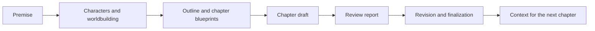

<div align="center">

**English** | [中文](README.md)

</div>

<p align="center">
  
</p>

<h1 align="center">AI Novel Writer / AI 小说作家</h1>

<p align="center">
  A local-first desktop workspace for long-form fiction. It organizes “premise → characters → worldbuilding → chapter blueprints → draft → review → revision → final” as a traceable writing workflow. You configure the model; your project material stays on your computer.
</p>

<p align="center">
  <a href="https://github.com/poluce/AI-Novel-Writer/releases"></a>
  <a href="https://github.com/poluce/AI-Novel-Writer/blob/master/LICENSE"></a>
  <a href="https://github.com/poluce/AI-Novel-Writer/stargazers"></a>
</p>

<p align="center">
  <a href="https://github.com/poluce/AI-Novel-Writer/releases/latest">Download desktop (Windows / macOS)</a>
</p>

<p align="center">
  
</p>

> ## v1.1.0
>
> - **Source-grounded continuity material** — Author-provided character information, model-derived progress, and legacy data with unknown provenance are no longer presented as the same kind of fact; later writing prefers finalized source prose with an identifiable origin.
> - **Layered chapter materials** — The current task, future plans, finalized history, and candidate drafts are shown separately, with adjacent source paragraphs retained when they carry causality, negation, or item transfers across sentences.
> - **Reliable candidate context** — Review-draft batches continue from the exact saved draft versions and prose in the current run and label them as unfinalized.
> - **Goal-by-goal review** — Each chapter event shows whether it is completed, unmet, or needs verification, alongside source excerpts, so preparation or a promise is not automatically treated as completion.
> - **Author-controlled goal revision** — Unverified items are not passed checks, and unmet or unverified chapter goals enter revision only when the author explicitly includes them, reducing rework caused by model misjudgments.
> - **Update, export, and notification fixes** — Update checks no longer repeat during a download, split Markdown exports use independent directories, and workflow-completion notifications keep the full title.
>
> These changes reduce the risk that a mistaken summary or outdated state affects later chapters, but they do not replace author review or guarantee drift-free prose or perfect target-length compliance.

### Features retained from 1.0.0

- Writing Skills can be installed independently and used for planning, drafting, review, or polishing.
- The story map shows main and side-story progress and links to the supporting chapter.
- Planning material can be imported so blueprints and later writing share the same settings.
- The character roster adds explicitly confirmed blueprint characters and tracks their state.
- The Chinese long-form workflow connects blueprints, drafts, reviews, revisions, and final chapters.
- Windows and macOS users can view and start the update intended for their computer.

The 1.0.0 fixes for multi-draft saves, stale requests, source recovery, exports, and installation checks remain included; see the [bilingual 1.1.0 notes](.release/notes/v1.1.0.md) for each change. Official installers are published through [GitHub Releases](https://github.com/poluce/AI-Novel-Writer/releases/latest).

> ## v0.9.0 feature baseline (historical release)
>
> [v0.9.0](https://github.com/poluce/AI-Novel-Writer/releases/tag/v0.9.0) makes continuity, chapter control, and review-driven revision more complete for long-form fiction while continuing to ship Windows, macOS Apple Silicon, and macOS Intel installers:
>
> - **Long-form continuity context** — Explicit author settings, the premise, characters, worldbuilding, outline, blueprints, and finalized facts carry into later writing to reduce forgotten setup and contradictions.
> - **Foreshadowing and narrative threads** — See suggested hooks, planting and payoff chapters, active threads, and overdue reminders in one place, making long-running suspense easier to plan and resolve.
> - **EPUB import and an interactive character graph** — Import EPUB2 / EPUB3 text through the existing chapter-splitting flow; zoom, pan, or clear the character relationship graph.
> - **Per-chapter model and length control** — Single-chapter and continuous writing honor the selected model and target length for each run. Duplicate jobs for the same target are blocked with a clear notice.
> - **Human-confirmed review loop** — Edit, ignore, or add review items, confirm the checklist, revise from that confirmed guidance, then inspect the diff before choosing whether to merge.
> - **Smoother model setup** — Advanced model settings expose supported reasoning effort and temperature controls. After entering an API key and Base URL, fetch the model list directly without first saving an incomplete configuration.
> - **More precise failure messages** — Content restrictions, provider failures, and duplicate jobs report a more specific cause, and incomplete output is not saved as successful project content.
>
> One Release uses the exact seven-asset contract: `ai-novel-writer-setup-0.9.0.exe`, `ai-novel-writer-setup-0.9.0.exe.blockmap`, `latest.yml`, `ai-novel-writer-mac-arm64-0.9.0-installer.dmg`, `ai-novel-writer-mac-arm64-0.9.0-installer.dmg.sha256`, `ai-novel-writer-mac-x64-0.9.0-installer.dmg`, and `ai-novel-writer-mac-x64-0.9.0-installer.dmg.sha256`. The Windows installer is not code-signed; both macOS installers use ad-hoc signing, have no Developer ID signature, and are not notarized, so their platform security prompts may require manual confirmation on first launch.


## What this product is

AI Novel Writer is not a hosted model service or an online fiction platform. It is the orchestration layer for a writing project: it keeps project state, organizes prompts and context, manages blueprints and draft versions, and connects generation, review, and revision.

You may connect local or cloud models; the app does not provide or host model quotas. For long-form work, it assembles the current chapter blueprint, relevant character material, worldbuilding, history summaries, and optional style references instead of putting an entire novel into one chat transcript.



## Interface preview


## Core capabilities

| Capability | What it does |
| --- | --- |
| Structured writing workflow | Organizes premises, characters, worldbuilding, blueprints, drafts, reviews, revisions, and finals by stage. |
| Chapter-level generation | Builds context around the current chapter blueprint and related material to reduce cross-chapter drift. |
| Failed-generation recovery | If chapter generation fails after producing visible prose, the app saves it as a project-local recovery candidate; it is not a formal draft and cannot be continued after its source blueprint or draft changes, but it can be discarded. |
| Review and revision | Produces structured review information for a draft and uses that report as revision input. |
| Character cards and project material | Maintains characters, worldbuilding, blueprints, drafts, and finals in the project. Project sessions prevent an old window from writing into a newly reopened project. |
| Plot tree and narrative threads | Shows main plots, subplots, and source progress on chapter tracks. The plot tree is a rebuildable read-only snapshot, not a replacement for author facts. |
| Writing Skills and prompt templates | Binds supplemental methods by writing stage and customizes Chinese or English creative guidance while hidden contracts preserve language, output structure, and tool protocols. |
| Writing-style control | Finalizing a chapter does not automatically rewrite the style in the novel configuration. You can still edit it manually, run writing-style analysis, or import a novel to build imitation guidance. |
| Reference text and knowledge base | Imports common text formats as reference material. SQLite FTS remains available when no embedding model is configured. |
| Batch writing task | A separate batch chapter task supports 1–10 chapters, pause, and cancel; downstream processing failure stops later chapters. |
| Chinese and English UI | The first launch can follow the system locale; a manual choice is persisted. |
| Writing assistant | The side panel offers two assistants. The **project assistant** works on the open project — it can read project material, start workflows, and read or write files and run commands inside the project folder (each one needs your confirmation), keeping its conversations inside the project folder. The **app assistant** needs no project, is always available, works in its own `~/.vela/workspace`, and keeps its conversations in the app data folder. Opening a project switches to the project assistant automatically. Skill instructions are loaded on demand: the listing carries names and descriptions only. |

When generating a plot outline, you can enter an explicit chapter range in “Generate story architecture.” Projects longer than 20 chapters default to Chapters 1–20. After one batch finishes, continue from the next chapter; if generation stops with a valid checkpoint, resume from it. If you edit the existing outline or any source settings or guidance used for generation, the old checkpoint cannot continue directly into the new content; regenerate the affected range instead.

## Model configuration

The app currently supports two request protocols:

- **OpenAI-compatible** — for OpenAI, DeepSeek, Ollama, and other compatible Chat Completions services.
- **Native Gemini** — for Google Gemini-compatible endpoints.

“Custom API” means a configurable URL, model identifier, and credential within those protocols. It is not an arbitrary HTTP protocol editor or a place to run user-supplied scripts. Protocols such as Anthropic Messages, Azure OpenAI, or native KoboldAI require dedicated adapters rather than a URL swap.

Writing generation requires **native function / tool calling**. Structured results and chapter prose are submitted once through tools; the app no longer parses JSON or XML out of the model’s visible text. Project files, model profiles, and prompt overlays stay in the same locations. If an old custom prompt still says “output JSON only,” restore the built-in default in Settings.

### Ollama

Use Ollama through its OpenAI-compatible service:

```text
Provider:  Ollama (local) or Custom
Protocol:  OpenAI-compatible
Base URL:  http://127.0.0.1:11434/v1
API key:   may be left blank; if the UI requires one, use a local placeholder
Model:     your Ollama model name, for example qwen3:14b
```

Embedding models should also use `/v1`. Do not set the Base URL to `http://127.0.0.1:11434/api`: `/api` is Ollama's native path, not the OpenAI-compatible embedding path used by this application.

## Data, privacy, and boundaries

| Data or behavior | Default location / destination |
| --- | --- |
| Novel projects, characters, blueprints, drafts, and finals | Your project folder and local SQLite database. |
| Failed-generation recovery candidates | Stored only in the current project's local SQLite database; they do not automatically become drafts, finals, or continuity facts. |
| Imported reference material | Remains within the local project scope unless you choose to send it to a cloud model. |
| Local-model requests | Sent to the local or LAN inference service you configure. |
| Cloud-model requests | Prompts and context go to the provider you choose, such as OpenAI, DeepSeek, Gemini, or another cloud endpoint. |
| Model configuration and API keys | Currently stored in the local user-profile file `~/.vela/models.json`; protect your OS account and do not share this file. |
| App preferences and deferred-update settings | Stored in `~/.vela/config.json`. |

The app does not provide model accounts, cloud generation, or operational-message pushes. Update checks read public GitHub Releases only; users can check manually and defer a discovered version reminder.

## Installation and updates

### Windows x64

Formal releases use a Windows NSIS installer:

```text
ai-novel-writer-setup-<version>.exe
```

1. Download formal installers only from [GitHub Releases](https://github.com/poluce/AI-Novel-Writer/releases/latest).
2. The installer updates the application and should not delete novel projects, character cards, or existing settings. Back up important work before any upgrade.
3. After installation, use **Check for updates** on the welcome page. The app also performs at most one successful silent check per local day after startup. A discovered update is announced first and downloads only after the user chooses **Download update**; when the download finishes, the app offers **Restart and update / Later**.
4. Older portable ZIP builds cannot obtain their first updater automatically. Install a formal installer manually once; new portable ZIP releases are no longer maintained.

The installer is not code-signed at present. Windows may show publisher or reputation warnings; continue only after confirming that the download page is this repository's official GitHub Release.

### macOS (Apple Silicon and Intel)

Download the installer matching your Mac architecture from [GitHub Releases](https://github.com/poluce/AI-Novel-Writer/releases/latest):

```text
ai-novel-writer-mac-arm64-<version>-installer.dmg
ai-novel-writer-mac-x64-<version>-installer.dmg
```

1. `arm64` supports Apple Silicon Macs (M1, M2, M3, M4, and later); `x64` supports Intel Macs.
2. Drag the app from the DMG to Applications. The app can check the latest formal GitHub Release and display a reminder, but it does not download or replace the macOS app. The update action opens the official Release page so the user can download the installer for the correct architecture.
3. Both installers are ad-hoc signed, have no Developer ID signature, and are not notarized. If Gatekeeper blocks it, confirm that the source is this repository's official GitHub Release, then Control-click the app in Finder and choose **Open**, or allow it in **System Settings → Privacy & Security**.

## Current limits

- A URL and key do not guarantee support for every third-party API; only implemented protocols and presets are in scope.
- The app does not replace authorial judgment, fact checking, or copyright decisions. Review AI output before using it.
- It does not provide online publishing, a reading community, or cloud-model accounts.
- Formal installers are built in GitHub Actions. Windows, macOS ARM64, and macOS x64 candidates each pass their own qualification before they are listed in one GitHub Release.

## Development and architecture documentation

See [`docs/README.md`](docs/README.md) for documentation authority, ADRs, research, agent rules, and dated handoffs.

## License

[GPL-3.0](LICENSE)
